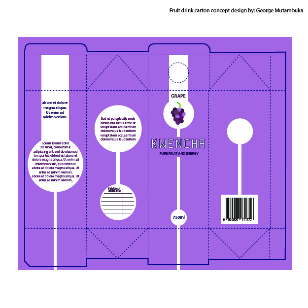
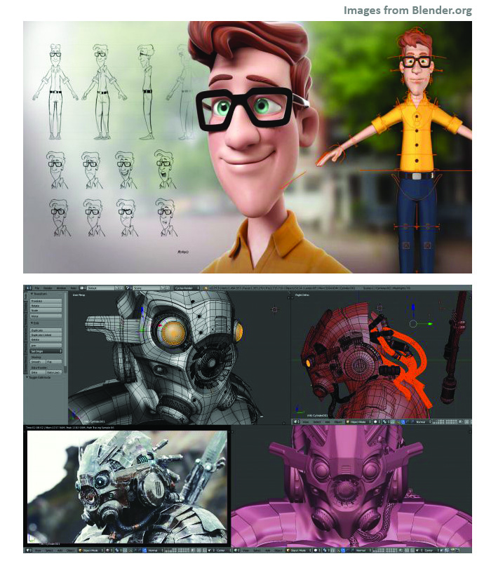
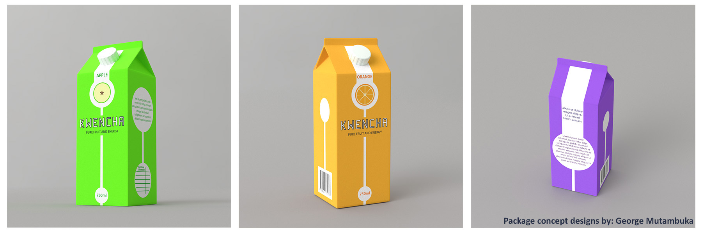

When designing a product - like in the case of package design, it is important or even necessary to include a mock-up when showing to your client.

Not only when the project is  complete, but right from the initial concept design up to the final version, because to be honest, how many people can know how a package will look like just by viewing the dieline flat design (this is what is used for creating the actual package)

 This is how designers create their package layout designs, we really aren’t concerned about the 3D final but what is important is obeying the rules when it comes to designing for packaging

The most common way is to use mock-ups created with Adobe Photoshop and take advantage of the smart objects feature where you can just keep changing the design of your mock-up without affecting the actual set up of your mock-up scene, the downside however is, what if the client wants multiple views of the mock-up? You would have to look for or create another scene with another angle, which can be difficult or easy depending on the product and how you presented it.

This is where using 3D software comes in handy. But seeing 3D software isn’t for everybody – the learning curve is steep and learning it just for the sake of making mock-ups may sound kind of silly but if you already know how to use one or have been wanting to venture into motion graphics, animation, digital sculpture or game design this is another added bonus you’ll find 3D software can do.

But what about price? The software is notorious for its cost! Well no need to worry because there is an open source (free) software called Blender which is my weapon of choice for anything 3D and VFX.

 Blender has been in development for many years and is now a very powerful 3D creation suite.   I would recommend learning a 3D software to any graphic designer especially if you are involved in video editing too.

**Benefits of using 3D software for mock-up**

- The instant availability of multiple angles,
- The ability to create ultra-realistic renders (by using physically based render options),
- The option of turning the mock-up into a video animation using the very same scene.

Another advantage the less 3D savvy may not be aware of is; once you have a project file for your mock-up you can transport the resources to other 3D software, even Photoshop and After Effects (by exporting the item in .obj format).

And just like with the smart objects of Photoshop, you can change the design without worrying about spoiling your mock-up scene.

The option of using 3D software for mock-ups isn’t for everybody or every project but I find the advantages very beneficial and I use it whenever the situation calls for it.

_Article by: George ( TheGiwi ) Mutambuka – Multi-disciplinary freelance designer and creative based on the African continent._
