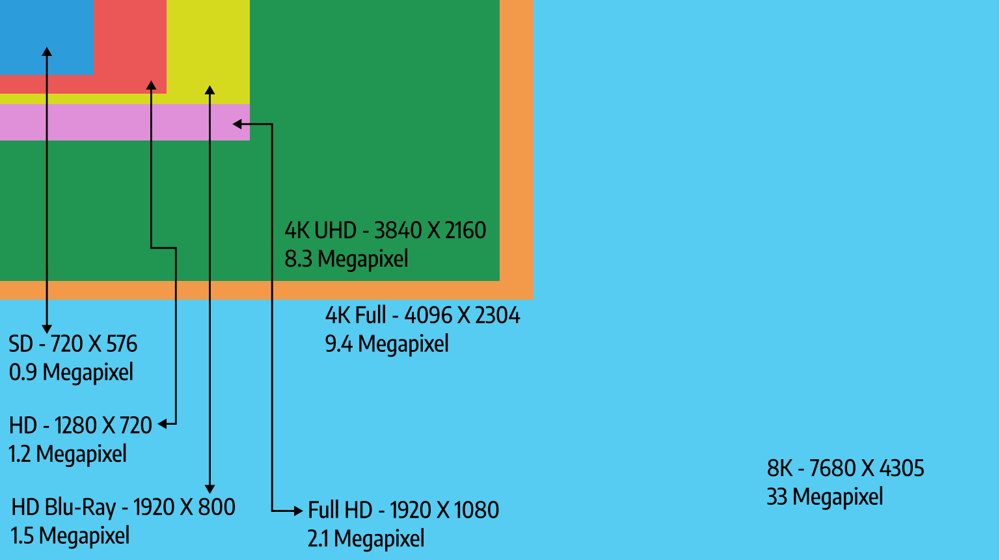
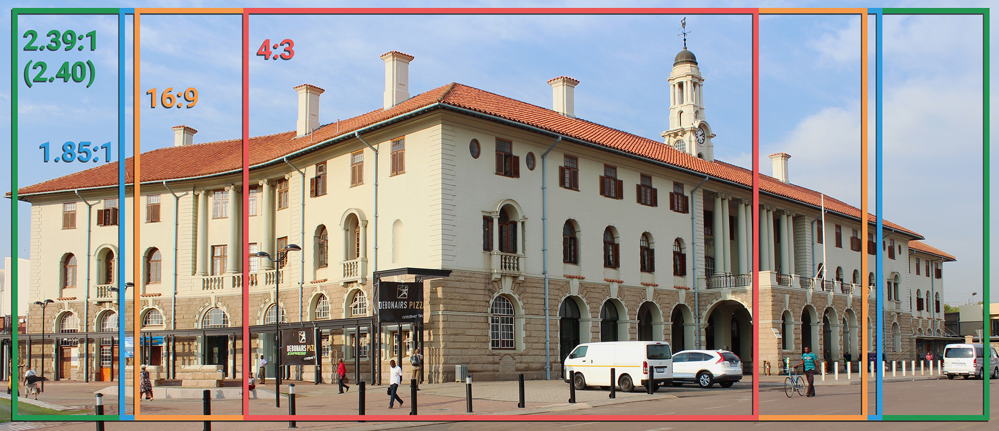
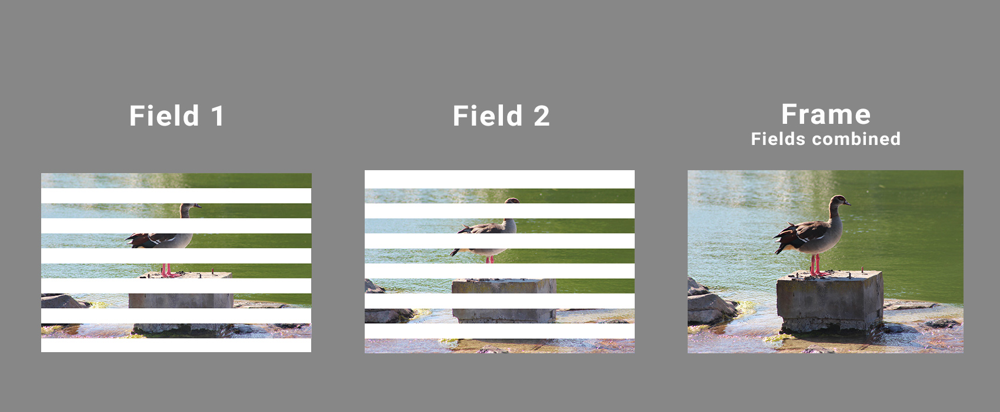
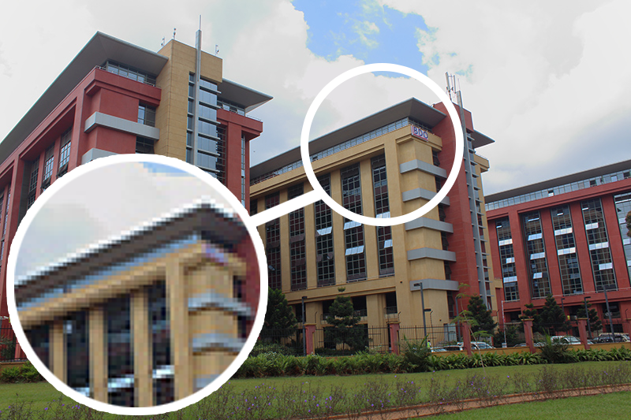
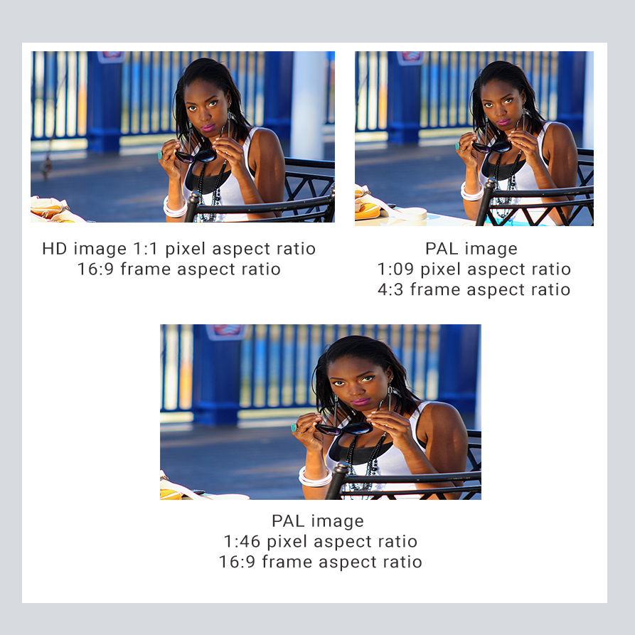

As a mostly self-taught videographer, I had to learn a lot of things the painful way (but thanks to Google and forums like [creativecow.net](https://www.creativecow.net/) I was helped to overcome), this is why I’ve decided to compile this article for whomever may be in the situation I was in as a newbie in video editing.

This article isn’t a “how to edit” guide but more of a basic technical reference guide on what video actually is and the different terminologies you will run into when working with video formats.

After all, before you can edit you need to understand what it is you’re editing otherwise you’ll run into production quality issues which can destroy your reputation and business.

**Frame Rate and Resolution**

When we watch footage recorded in video or film we are actually looking at a sequence of pictures played back at a certain speed. The term “Movie” is actually derived from motion picture.

24 frames per second (FPS) for capture and projection was the eventual rate that was preferred during the early days of film. Though today we have variations on the frame rate depending on what region of the world you live in: 24 FPS – Film, 25 FPS – PAL, 29.97 FPS – NTSC (also referred to as 30 FPS).

Higher frame rates are also available and used but we won’t be exploring those areas in this specific reference.

The size of the frame is called its **resolution** (number of pixels in width x height)**,** and its shape is called the **aspect ratio** (ratio of the width to the height of the frame),

 Most common video resolutions with megapixel sizes (By: George Mutambuka)

 Most popular aspect ratios (By: George Mutambuka)

A screen’s resolution and the resolution of the video it’s playing do not always correspond, in order to witness a video’s true resolution and quality you must watch it on a screen that matches the video footage “pixel to pixel” (that can be a bit difficult given the variety of video file resolutions available), so for example if you want to see the beauty of UHD (Ultra High Definition), you need a UHD display (TV/ monitor/projector) and remember watching SD on a UHD display will not make the SD better it will just expose imperfections more. And just another note to remember (just for the sake of it) is that your smartphone, tablet, laptop and TV can all have the same resolution. It’s just that the pixels are more densely packed on the smaller devices, this is what the term PPI (Pixels per Inch) is referring to.

**Slow motion:** The ideal method of achieving slow motion is to record video footage at a high frame rate (e.g. 150 FPS) and then play it back at a regular speed (e.g. 25 FPS), fast motion is just the reverse of that, it is important to note that using editing software it is possible to achieve slow motion from regular speed video footage (25/30 or 24 FPS) but the effect doesn’t produce the same quality, smoothness and detail as in video acquired at a higher frame rate.

Also check out this video on [YouTube by Andre Sirios](https://www.youtube.com/watch?v=LTW3xXrYkIY) if you want to know how music videos achieve slow motion but the music is being sung at normal speed

**Interlaced and Progressive**

In order for us to see a video image on a screen it has to be “built up” or scanned onto the screen first. There are two processes that can be used; **interlaced scan** and **progressive scan** (film projectors don’t use either of these).

Interlaced video builds each frame in alternating lines from top to bottom, each scan that builds one half of the video frame is called a field, meaning it takes two fields to build one frame.

 Fields and frames explained (By: George Mutambuka)

This is an example of how an interlaced video file would look like: _Content.avi 1080i 50_ where “Content” is the name of the footage, “.avi” the format, “1080” the vertical pixel count (resolution) followed by an “i” to indicate interlaced and then “50” to indicate 50 fields per second (sometimes indicated as 50 Hz), so we automatically know that it has 25 FPS because we divide the fields by two, the same applies for any system whether it be PAL, NTSC or HD.

Progressive video builds each frame in sequential order from one up to the limit of the given video’s resolution. Fields are a non-issue because one progressive scan equals one field, thus, one frame is one field.

This is an example of how a progressive video file would look like: _Content.mov 1080p 25_ where “Content” is the name of the footage, “.mov” the format, “1080” the vertical pixel count (resolution) followed by a “p” indicating progressive, then “25” indicating 25 frames per second.

Some digital broadcast (SD and HD) and all anologue TV are broadcast using interlaced scanning, as well as media derived from all VHS, miniDV and some DVDs.  UHD, 4K and 8K formats are exclusively progressive and do not support interlacing.

**Interlacing Issues:**  There are no problems when displaying an interlaced video on an interlaced display like those old analogue CRT TVs with “big backs”, however problems arise when you have to display on a progressive medium like YouTube or modern LCD flat screen displays, such video quality problems are fixed by using a process called **deinterlacing**. In a computer screen (progressive) the media player does it for you, in a DVD that is connected to a progressive display (flat screen TV) the DVD player will handle the interlacing and on a broadcast the TV or decoder/set top box (in the case of satellite, cable or digital terrestrial) handles the conversion from interlaced source to progressive display. However if you’re editing a mixture of interlaced and progressive footage in the same timeline; you will have to decide which footage to convert so you won’t run into any problems in your final output.

 Interlaced Video problem. (By Mikus \[Public domain\], from Wikimedia Commons)[Source](<https://commons.wikimedia.org/wiki/File:Interlaced_video_frame*(car_wheel).jpg>)

**Pixels**

A **pixel** is a single dot on a screen that makes up the overall picture, as mentioned before the number of pixels indicates the resolution of the image.

 Pixels magnified in a photograph. (By: George Mutambuka)

Pixels on a screen however, are made up of three smaller dots (mainly referred to as sub pixels), where each dot represents one of the three additive primary colors, red, green and blue (or RGB as it is referred to in the video and photography industries.) In order to output the various colors and brightness intensities the sub pixels individually light up in different values depending on what part of the picture in the frame they fall on

 Magnified RGB sub-pixels on a display screen.[(Photo by Michael Maasen on Unsplash)](https://unsplash.com/photos/AkYGy_ymFqo)

**Pixel aspect ratio** refers to the aspect ratio (ratio of width to height) of the pixel itself, for example if you are editing video that is 1280 x 720 (which has a pixel aspect ratio that is 1:1 often referred to as square pixels) for a 1920 x 1080 display, what you would do is scale the video up but keeping the frame’s aspect ratio, which is 16:9 the exact match of the display, even though your video and display resolutions don’t match the aspect ratios are both 16:9, but if you were to use 1440 x 1080 or 720 x 480 video on the same 1920 x 1080 edit, seeing that the video aspect ratios won’t match 16:9 if the pixel aspect ratios were square, the footage needs to be “stretched” somehow in order to fit in. The method used is to give the pixels a rectangular aspect ratio, stretching them out slightly.

 Photo by George Mutambuka

Not all video with a frame aspect ratio of 16:9 (aka widescreen) have the same resolution thus not all their pixel aspect ratios are the same. If you want to witness this live you can just watch VHS video on a widescreen TV and make sure the TV’s setting is set to fill up the screen, you will notice that the image looks stretched.

I hope this has been an informative article and you will have had some gaps filled in your understanding of video specifications. There is the point of video formats that I didn’t explain about and I highly recommend this video by Videomaker which explains it clearly [https://www.youtube.com/watch?v=fLlkgTRZSzc](https://www.youtube.com/watch?v=fLlkgTRZSzc)

Cheers.
